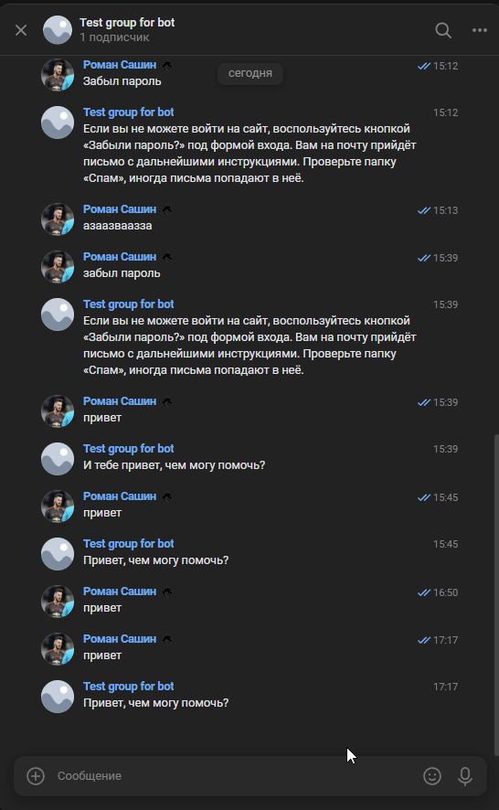

# Telegram & VK DialogFlow Bots

Этот проект — это два чат-бота для Telegram и VKontakte, которые интегрированы с DialogFlow от Google. Боты умеют отвечать на заранее обученные вопросы с помощью искусственного интеллекта.

## Что умеют боты

* ✉ Отвечают на частые вопросы, например:

  * "Как устроиться к вам на работу?"
  * "Забыл пароль"
  * "Хочу удалить аккаунт"
*  Работают на базе DialogFlow: распознают намерения (intents) и подбирают релевантные ответы
*  Отправляют логи в Telegram в случае ошибок (для мониторинга работы ботов)
*  Если бот не понимает сообщение, он молчит (чтобы не мешать техподдержке)

## Что такое DialogFlow

[DialogFlow](https://dialogflow.cloud.google.com/) — это платформа от Google для создания чат-ботов, которая распознаёт естественную речь, анализирует намерения и отправляет ответные сообщения. Поддерживает множество языков, включая русский.

## Структура проекта

* `telegram_bot.py` — бот для Telegram
* `vk_bot.py` — бот для ВКонтакте
* `learn_dialogflow.py` — скрипт для обучения DialogFlow новыми фразами
* `logger_config.py` — настройка логгирования ошибок в Telegram
* `questions.json` — файл с обучающими примерами (intents)
* `.env` — секреты и токены (не публикуется)

## Ссылки на работающих ботов

* 👉 [Telegram бот](https://web.telegram.org/k/#@verbgametechhelpbot)
* 👉 [VK бот](https://vk.com/club231073553)

## 🎞️ Гифка диалога



## Как запустить

```bash
python3 -m venv venv
source venv/bin/activate
pip install -r requirements.txt
python telegram_bot.py  # или python vk_bot.py
```

## License

MIT

---

Боты готовы к бою! Загляните в код, напишите что-то боту и получите осмысленный ответ.
